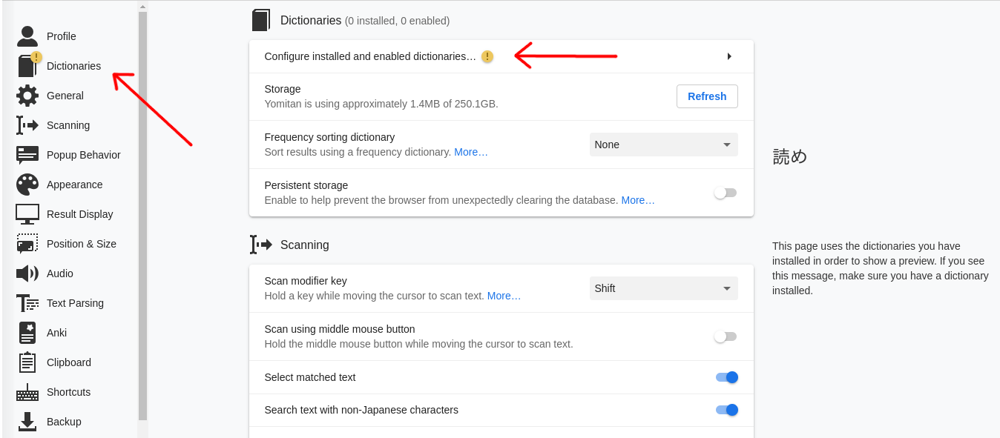
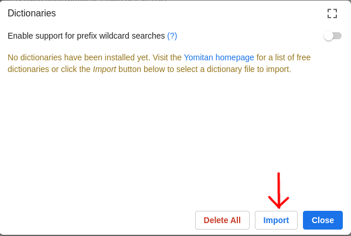
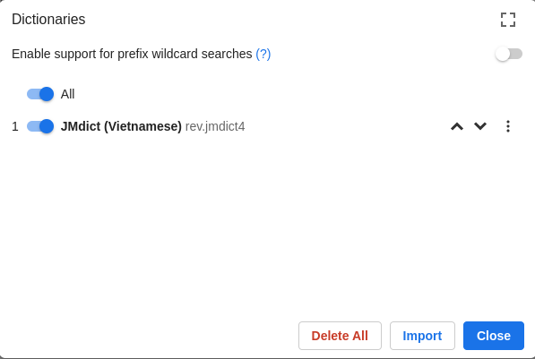
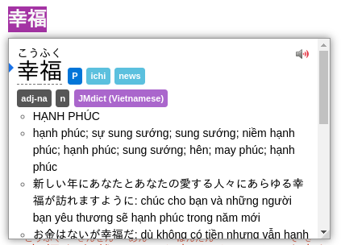

# yomichan-vietnamese-dict-Lighter-mod

## Introduction

This is a lighter version of the Vietnamese JMdict. Data is added from the Mazii dictionary

Đây là phiên bản nhẹ hơn của JMdict tiếng việt. Dữ liệu được bổ sung từ từ điển Mazii

## Install & Usage

1. Add the yomichan or yomitan extension to your browser (Thêm extension yomichan hoặc yomitan vào trình duyệt)
2. Download file [jmdict_vietnamese(mod).zip](<./jmdict_vietnamese(mod).zip>)
3. Go to the settings page of yomichan (or yomitan) and add a dictionary. (Vào trang setting của yomichan (hoặc yomitan) thêm từ điển)
   
   
   
5. Select the jmdict_vietnamese(mod).zip file you just downloaded (Chọn file jmdict_vietnamese(mod).zip vừa download)

   
   
6. Hover over the text and press shift (di chuột trên chữ cần scan và nhấn shift)

   

## License

KANJIDIC (English) is copyrighted by [Electronic Dictionary Research and Development Group](https://www.edrdg.org/wiki/index.php/KANJIDIC_Project#Copyright_and_Permissions), and is used under their [license](https://www.edrdg.org/edrdg/licence.html).

The copyright of the mod is owned by Dao Nhat Minh. This mod is free to use, please do not use it for commercial purposes without the owner's permission. (Bản quyền của bản mod thuộc sở hữu của Đào Nhật Minh. Bản mod này được sử dụng miễn phí, vui lòng không sử dụng nó với mục đích thương mại mà không có sự cho phép của chủ sở hữu.)
